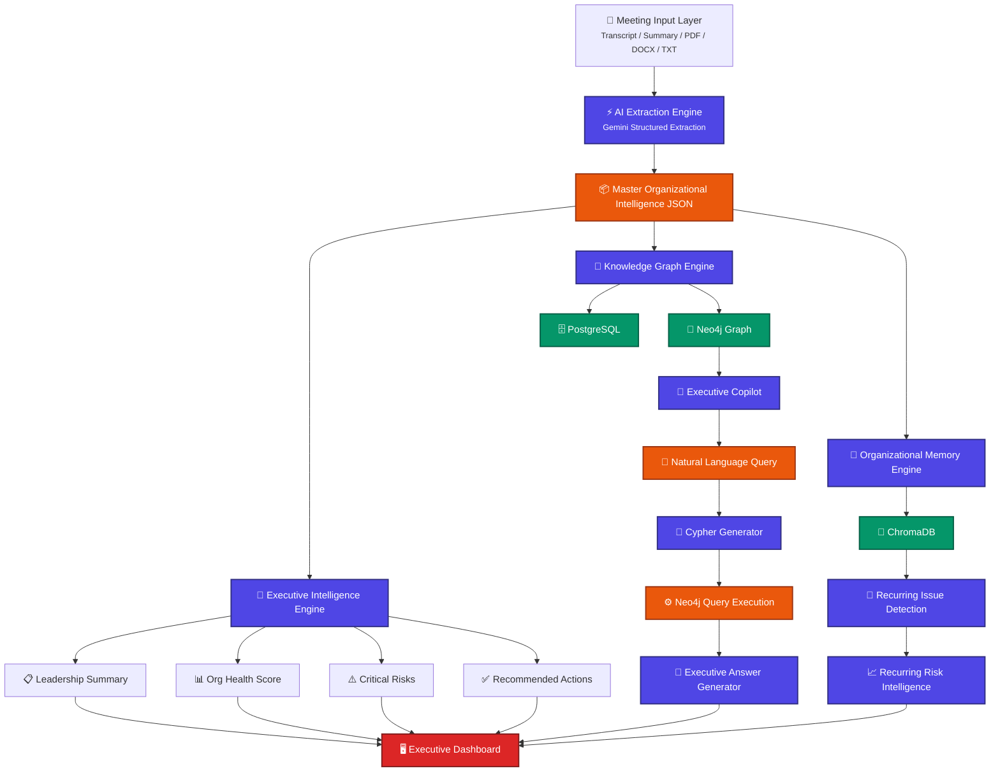

# OrgPulse AI

<p align="center">
  <picture>
    <source media="(prefers-color-scheme: dark)" srcset="https://img.shields.io/badge/orgpulse-ai-4F46E5?style=for-the-badge&logo=ai&logoColor=white">
    
  </picture>
</p>

<p align="center">
  
  
  
  
  
  
  
  
</p>

<p align="center">
  <b>Enterprise Organizational Intelligence Platform</b><br>
  Transform unstructured meeting data into actionable organizational intelligence.
</p>

---

- [Overview](#overview)
- [Architecture](#architecture)
- [Features](#features)
- [Tech Stack](#tech-stack)
- [Getting Started](#getting-started)
- [API Reference](#api-reference)
- [Project Structure](#project-structure)

---

## Overview

OrgPulse AI processes raw meeting transcripts, summaries, and documents through a multi-stage AI pipeline to produce:

- **Executive Intelligence** — leadership summaries, org health scores, risk identification
- **Knowledge Graphs** — relationship extraction and Cypher query generation
- **Organizational Memory** — recurring issue detection and institutional knowledge retention
- **Executive Copilot** — natural language interface to graph data

## Architecture



### Data Flow

1. **Ingestion** — meeting inputs enter through a dedicated layer supporting transcripts, summaries, and document formats.
2. **Extraction** — Gemini 2.0 Flash performs structured AI extraction, producing a normalized organizational intelligence JSON payload.
3. **Distribution** — the master payload fans out to three engines: Executive Intelligence, Knowledge Graph, and Organizational Memory.
4. **Storage** — processed data persists to PostgreSQL (relational), Neo4j (graph), and ChromaDB (vector/store).
5. **Query** — the Executive Copilot translates natural language to Cypher, executes against Neo4j, and returns synthesized answers.
6. **Presentation** — the Executive Dashboard consolidates intelligence, metrics, risks, and copilot answers into a unified interface.

## Features

| Module | Description |
|---|---|
| **Meeting Analysis** | Upload transcripts and summaries; 5-stage AI pipeline for extraction, briefing, graph mapping, insight generation, and recurring issue detection. |
| **Executive Intelligence** | Leadership summaries, organizational health scoring, risk identification, and recommended actions. |
| **Risks & Escalations** | Filterable risk and escalation tables with severity classification and search. |
| **Project Tracking** | Project health cards with resource allocation, dependency mapping, and decision logs. |
| **Knowledge Graph** | Natural language to Cypher query translation; Neo4j graph visualization; entity and relationship exploration. |
| **Organizational Memory** | ChromaDB-powered recurring issue detection; trend analysis across historical meetings. |
| **Analytics** | Recharts dashboards covering risk distribution, escalation trends, workload balance, decision patterns, and project health. |
| **Executive Copilot** | Conversational interface for querying organizational data in natural language. |
| **Settings** | API key management, database configuration, system health diagnostics, and cache controls. |

## Tech Stack

### Frontend

| Technology | Purpose |
|---|---|
| **React 18** | Component library and rendering |
| **Vite 5** | Build tool and dev server |
| **React Router 6** | Client-side routing with sidebar navigation |
| **Recharts** | Charts and data visualization |
| **Lucide React** | Icon system |
| **Axios** | HTTP client for API communication |
| **CSS Custom Properties** | Design tokens, theming, and component styles |

### Backend

| Technology | Purpose |
|---|---|
| **Node.js 18+** | Runtime environment |
| **Express** | HTTP server and API routing |
| **Mermaid** | Architecture diagram rendering |
| **Google Gemini API** | AI extraction, briefing, and copilot response generation |
| **PostgreSQL** | Relational data persistence (meetings, risks, projects) |
| **Neo4j** | Graph database for entity relationships and knowledge mapping |
| **ChromaDB** | Vector store for organizational memory and recurring issue detection |

### DevOps & Tooling

- Cross-env for environment variable management
- Nodemon for development hot-reload
- ESLint for code quality

## Getting Started

### Prerequisites

- Node.js 18+ and npm
- PostgreSQL 15 (optional, for relational storage)
- Neo4j 5 (optional, for knowledge graph)
- A Google Gemini API key or OpenRouter API key

### Installation

```bash
# Clone the repository
git clone <repository-url>
cd OrgPulse_AI

# Install server dependencies
cd server
npm install

# Install client dependencies
cd ../client
npm install
```

### Configuration

Copy the environment template and set your values:

```bash
cp server/.env.example server/.env
```

Edit `server/.env`:

```env
# AI Provider (Gemini or OpenRouter)
GEMINI_API_KEY=your_gemini_api_key_here
# or OPENROUTER_API_KEY=sk-or-v1-your_key_here

# Server port
PORT=3001

# Neo4j connection (optional)
NEO4J_URL=bolt://localhost:7687
NEO4J_USER=neo4j
NEO4J_PASSWORD=your_password
```

### Running

```bash
# Terminal 1 - Backend
cd server
node index.js

# Terminal 2 - Frontend
cd client
npx vite
```

The backend starts on `http://localhost:3001` and the frontend on `http://localhost:5173` (with API proxy to the backend).

## API Reference

| Method | Endpoint | Description |
|---|---|---|
| `POST` | `/api/analyze` | Stage 1 — Structured extraction from raw text |
| `POST` | `/api/brief` | Stage 2 — Executive brief generation |
| `POST` | `/api/cypher` | Stage 3 — Natural language to Cypher translation |
| `POST` | `/api/insight` | Stage 4 — Graph insight generation |
| `POST` | `/api/recurring/analyze` | Stage 5 — Recurring issue detection |
| `GET` | `/api/recurring` | Retrieve organizational memory |
| `DELETE` | `/api/recurring` | Reset organizational memory |
| `POST` | `/api/neo4j/run` | Execute raw Cypher query |
| `POST` | `/api/neo4j/ingest` | Ingest extracted data into Neo4j |
| `GET` | `/api/health` | System health diagnostics |

### Health Check

```bash
curl http://localhost:3001/api/health
```

Returns server status, AI provider configuration, Neo4j connectivity, and ChromaDB status.

## Project Structure

```
OrgPulse_AI/
├── client/                          # React frontend (Vite)
│   ├── src/
│   │   ├── components/
│   │   │   ├── layout/             # AppShell, Sidebar
│   │   │   ├── ui/                 # Design system (Card, Badge, etc.)
│   │   │   ├── dashboard/          # ResultsView components (legacy)
│   │   │   ├── brief/              # Executive brief components
│   │   │   ├── graph/              # Graph visualization components
│   │   │   └── recurring/          # Recurring risk components
│   │   ├── features/
│   │   │   ├── executive/          # OrgHealthGauge
│   │   │   ├── graph/              # GraphQueryPanel wrapper
│   │   │   └── memory/             # RecurringRisksDashboard wrapper
│   │   ├── pages/                  # Route pages (9 total)
│   │   ├── services/               # API client layer
│   │   ├── hooks/                  # Custom React hooks
│   │   ├── utils/                  # Utility functions
│   │   ├── styles/                 # CSS design tokens, global, components
│   │   ├── lib/                    # Sample data, helpers
│   │   └── types/                  # Type definitions
│   └── vite.config.js
├── server/                         # Node.js backend (Express)
│   ├── index.js                    # Server entry point, API routes
│   ├── geminiHelper.js             # Gemini/OpenRouter AI client
│   ├── db.js                       # PostgreSQL connection
│   ├── models/                     # Database models
│   ├── routes/                     # Route handlers
│   └── .env                        # Environment configuration
└── README.md
```

---

<p align="center">
  <sub>Built with React, Node.js, and Google Gemini AI</sub>
</p>
